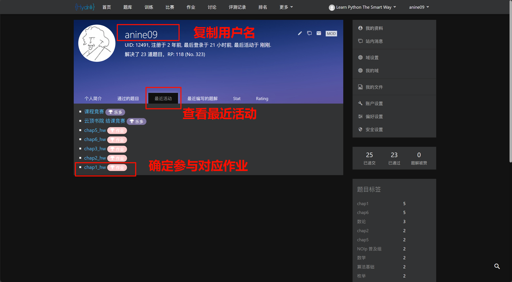

# 组队学习规则

## 学习者规则

- 无意违反任何规则，在合理范围内都有补救机会，如果有需要请及时联系助教。
- 课程主页包含绝大部分你所需要的内容，在询问所需资料之前请先探索课程主页。
- ==请保证你思考过问题，并确认没有遗留细节时再提问，任何提问必须符合提问规则，这是本课程的强制要求。==
- 除非涉及隐私问题，否则禁止私聊助教。
- ”先使用搜索引擎，找不到再提问“是每一名合格学习者的必备素养。
- 有问题也可以先问问 AI，例如文心一言、ChatGPT、New Bing、Claude 等，AI 有能力大部分简单问题解决。
- ==由于本课程实行滚动淘汰制，所以建议你将作业系统用户名和当前微信昵称保持一致，如果你不希望这样，请在作业系统个人简介里说明当前微信昵称，或者发邮件向教学团队说明，否则可能导致被错误踢出学习群。==
- ==一旦我们无法检测到你认领编程作业，你就会面临被定时清退出群的风险，请保证助教知道你的**作业系统昵称所对应的微信名**。==
- 如果被错误踢出群，请发送邮件向教学团队申诉。
- 我们不认为不写代码能学好 Python，无特殊情况时，必须至少完成 3 道编程基础题且都为 100 分才能获得作业评分，仅有笔记链接时，作业分判 0。
- **《Task 01：课程简介、安装 Installation》 没有编程作业，提交笔记链接即可。**

!!! info "评分时只参考打卡链接，具体规则如下"
    1. 如果没有写课程笔记，请直接提交作业系统的个人主页链接。
    2. 如果写了笔记则直接提交笔记链接，请将个人主页链接放在笔记内容开头处，方便助教获取。
    3. **再次重申，个人主页链接是编程作业完成情况的证明，助教没看到个人主页链接会判 0 分。**

!!! info "获取作业系统的个人链接"
    1. 登录 [Hydro](https://hydro.ac)，进入 [P2S 作业域](https://hydro.ac/d/datawhale_p2s/)，点击右上角你的用户昵称。
    
    2. 把浏览器地址栏对应的链接复制提交，链接一定以 `https://hydro.ac/d/datawhale_p2s/user/` 开头。
    

## 助教规则

- 任何不清楚的问题，请及时联系教学团队。
- 请专业助教联系教学团队，提供个人主页链接，来开通作业系统相关权限。
- 原则上我们**不允许直接回答学习者问题**，需要引导其自行探索并解决问题（苏格拉底式提问）。
- ==如果问题不符合提问规则，助教必须明确告知，并引导其按照正确格式提问。==
- 未完成打卡同学需要在下次打卡前清退出群，**如果无法定位微信昵称，直接清退。**
- 学习笔记只判断是否优秀，由助教自行定夺。
  !!! info "编程作业评分流程"
  1. 点击学习者提供的个人主页链接，**复制用户名**，点击“最近活动”，查看是否有对应作业的活动。
     
  2. 打开对应作业，查看“成绩表”，在成绩表中搜索用户名，即可看到作业完成详情，**100 分才算完成当前作业（课程竞赛除外）**。
     
     

!!! info "作业评分标准"
    - 水卡：0 分
    - 有笔记 + 没做题：0 分
    - 只通过了一题：1 分，有笔记就加 1 分
    - 只通过了两题：2 分，有笔记就加 1 分
    - 通过了三道题 + 没笔记：3 分
    - 通过了三道题 + 一般笔记：4 分
    - 通过了三道题 + 优秀笔记：5 分
    - 通过了四道题：4 分，有笔记就加 1 分
    - 通过了五道题：5 分，有笔记就推选优秀作业
    - 通过了四道题以上，笔记优秀的，单独推送给教学团队，记录到优秀笔记墙
